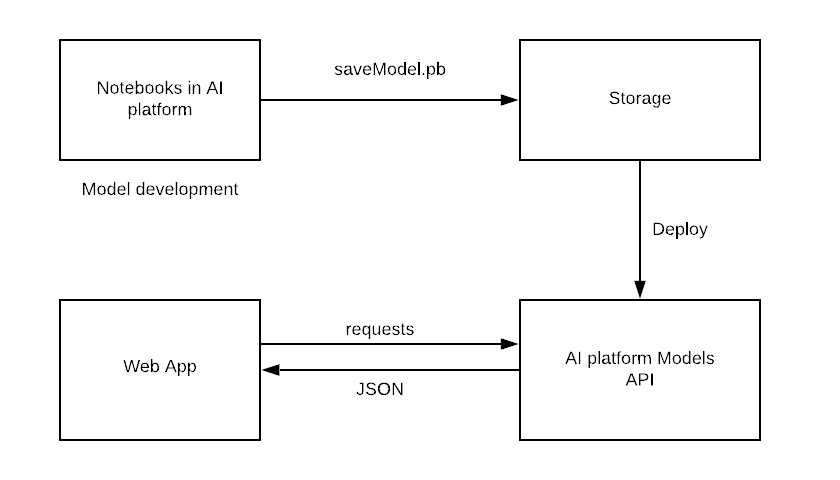
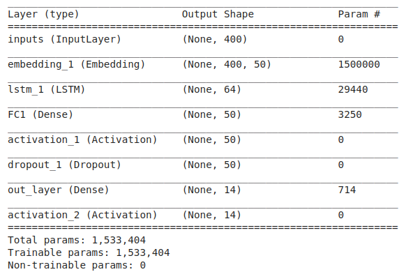

# Document Classification Solution

The web app is deployed in GCP and available at https://protean-unity-251012.appspot.com/

## Table of contents

- [Document Classification Solution](#document-classification-solution)
  - [Table of contents](#table-of-contents)
  - [Approach](#approach)
  - [Results](#results)
  - [How to run](#how-to-run)


## Approach

1. Process
   
   

2. Exploratory Data Analysis: 
   
   In this step, I investigate corpus, null value, vocabulary size, distribution of sentence length. Sentence length and vocabulary size are important because I would use these values to train model. More details are available at [EDA](EDA.ipynb).
   
3. Models: 
   
   I decided to use two state-of-the-art models, convolutional neural network and LSTM. Both used an embedding layer to vectorize words, followed by feature extraction layers and a fully-connected layer for classification at the end. These architecture are as follows

   Convolution Neural Network

   

   LSTM model

   

   All models are in Keras but converted to __Tensor Flow Estimator__ with serving and input function for predictions.

4. Evaluation: 
   
   I split data into training and test set by ratio 70:30. Models are evaluated based on **accuracy, F-1 score for each label and confusion matrix**


5. Google Cloud Platform and Web App UI
   
   To setup Google Cloud Platform for this project, please refer to this [document](https://codelabs.developers.google.com/codelabs/cloud-vision-app-engine/index.html?index=..%2F..index#8).
     

## Results

1. Accuracy

   The results:

   |Metrics|ConvNN|LSTM|
   |:------|:----:|:---:|
   |Accuracy|85%|76%|

2. F-1 score
  
    - Precision: Minimize False Positive Rate (TP / (TP + FP))
    - Recall: Minimize False Negative Rate (TP / (TP + FN))

    Convolutional Neural Network

   

    LSTM
    
   

3. Confusion Matrix

   Convolutional Neural Network

   
   
   LSTM

    

4. Conclusion

   |ConvNN|LSTM|
   |:----:|:---:|
   |Train faster with comparable result|Train longer|
  


## How to run

```bash
git clone https://github.com/mrthlinh/Document_Classification_Solution.git

cd Document_Classification_Solution/webApp

export PROJECT_ID=[YOUR_PROJECT_ID]

gcloud iam service-accounts create codelab \
  --display-name "My Codelab Service Account"

gcloud projects add-iam-policy-binding ${PROJECT_ID} \
--member serviceAccount:codelab@${PROJECT_ID}.iam.gserviceaccount.com \
--role roles/owner

gcloud iam service-accounts keys create ~/key.json \
--iam-account codelab@${PROJECT_ID}.iam.gserviceaccount.com

nano app.yaml -> CLOUD_STORAGE_BUCKET: <your-cloud-storage-bucket>

To deploy:

gcloud app deploy

```


